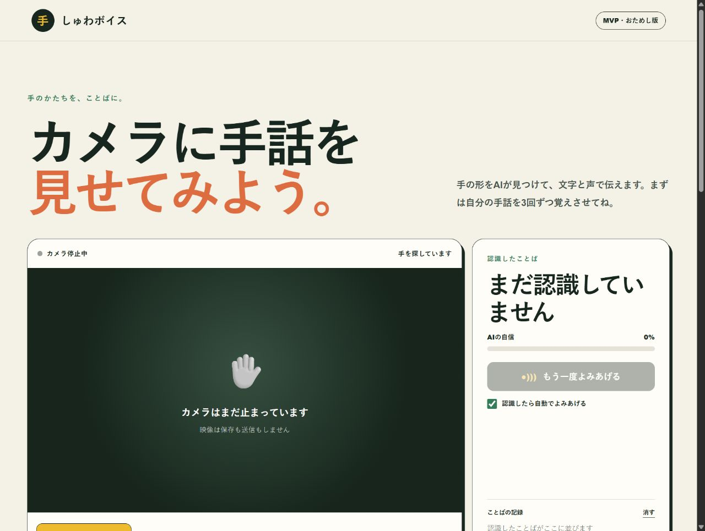
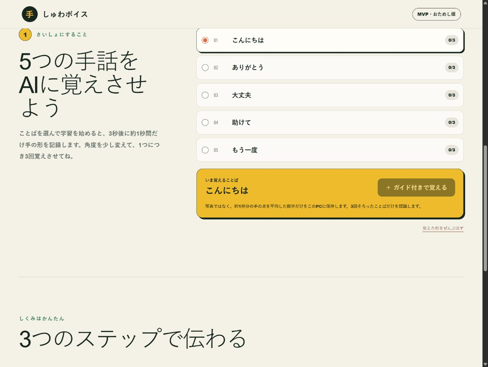

# しゅわボイス MVP

PCのカメラに手話の形を見せると、覚えた言葉を**文字と声**で伝えるWebアプリです。

> 今は、動かさずに見せる「手の形」を見分ける練習版です。最初に、自分の手の形を言葉ごとに3回ずつ覚えさせて使います。

## アプリを使ってみる

**[公開アプリを開く](https://shuwa-voice-mvp.gigach2025.chatgpt.site/)**

アプリはPCのブラウザで動きます。カメラの使用を許可してください。映像そのものは保存も送信もしません。



## 使い方

### 1. カメラを始める

画面の「カメラを始める」を押し、ブラウザにカメラの使用を許可します。手が画面の四角の中に入るようにしてください。

### 2. 覚えさせる言葉を選ぶ

画面を下へ動かすと、次の5つの言葉があります。

- こんにちは
- ありがとう
- 大丈夫
- 助けて
- もう一度

言葉の名前は入力欄で好きな言葉に変えられます。



### 3. 手の形を3回覚えさせる

覚えさせたい言葉を選び、「ガイド付きで覚える」を押します。

1. 3秒のカウントダウン中に手を準備します。
2. 「記録しています」と表示されたら、約1秒間、手を止めます。
3. 同じ言葉で3回くり返します。
4. 2回目と3回目は、手の角度を少しだけ変えると認識しやすくなります。

片手で始めた言葉は3回とも片手で、両手で始めた言葉は3回とも両手で見せてください。撮影中に手が消えたり、片手と両手が混ざったりしたときは、保存せずにやり直しを案内します。

### 4. 文字と声で伝える

3回の学習が完成した言葉の手の形をカメラに見せます。形が安定すると、右側に言葉とAIの自信度が表示され、声で読み上げます。

- 自動で読み上げたくないときは、「認識したら自動でよみあげる」のチェックを外します。
- もう一度聞きたいときは、「もう一度よみあげる」を押します。
- 認識した言葉は「ことばの記録」に並びます。

### 5. うまく認識しないとき

- 明るい場所で試す
- 手全体がカメラに入るようにする
- 背景と手の色が似すぎない場所で試す
- 手を動かさず、ゆっくり見せる
- 「学び直す」で、その言葉をもう一度3回覚えさせる

## このMVPでできること

- PCカメラから手の21個の関節点を見つける
- 約1秒分の関節点を平均し、安定した見本として保存する
- 3回学習した言葉だけを認識する
- 認識結果を文字と日本語音声で伝える
- 学習データを、このブラウザの中だけに保存する
- 言葉ごとの学び直しと、全学習データの削除

## まだできないこと

このアプリは、本物の手話通訳の代わりになるものではありません。現在は次のものに対応していません。

- 手の動きを使う手話
- 顔の表情や体の向き
- 日本手話の文法
- 長い文章の翻訳
- 学習していない言葉の認識

大切な会話では、表示された結果が正しいか相手と確認してください。

## プライバシー

- カメラ映像はサーバーへ送りません。
- 写真や動画は保存しません。
- 保存するのは、手の関節点から作った数字と、設定した言葉だけです。
- 学習データはブラウザの `localStorage` に保存します。
- 「覚えた形をぜんぶ消す」を押すと、保存した学習データを削除できます。

## 開発者向け：ローカルで動かす

必要なものはNode.js 22.13以降です。

```bash
npm install
npm run dev
```

ブラウザで `http://localhost:3000` を開きます。

品質チェックと本番ビルドは次のコマンドで実行できます。

```bash
npm run lint
npx tsc --noEmit
npm run build
```

カメラは、安全な接続であるHTTPSのページ、または `localhost` で使用できます。

## 使用技術

- Next.js / React / TypeScript
- MediaPipe Hand Landmarker
- Web Camera API (`getUserMedia`)
- Web Speech API
- localStorage
- OpenAI Sites / vinext

## 開発の記録

ガイド付き学習モードは、[Issue #1](https://github.com/bazaarjapan/shuwa-voice-mvp/issues/1)をもとに実装し、[PR #2](https://github.com/bazaarjapan/shuwa-voice-mvp/pull/2)でCodexレビューの指摘を修正して完成させました。

## ライセンス

現在、このリポジトリにはライセンスファイルを設定していません。コードを再利用・配布したい場合は、リポジトリの所有者に確認してください。
